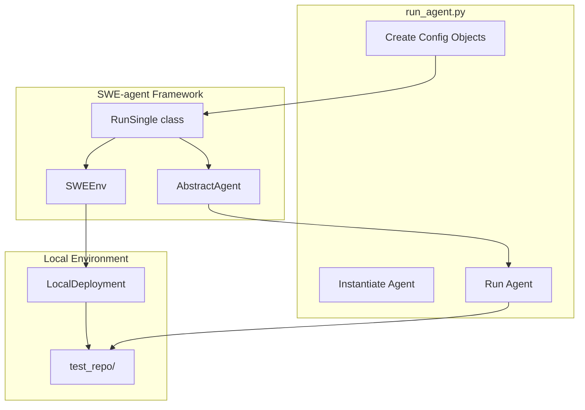

# Plan: Programmatic SWE-agent Test Scripts

## Overview
Create test scripts that use SWE-agent programmatically without the terminal. The agent will run locally on a test repository and automatically fix bugs.

## Architecture



## Key Components

### 1. Configuration Objects
Based on the codebase analysis:

- **RunSingleConfig**: Main configuration container
  - `env: EnvironmentConfig` - Environment settings
  - `agent: AgentConfig` - Agent settings
  - `problem_statement: ProblemStatementConfig` - The issue to fix
  - `output_dir: Path` - Where to save results

- **EnvironmentConfig**:
  - `deployment: LocalDeploymentConfig` - Use local subprocess
  - `repo: LocalRepoConfig` - Point to test_repo/
  
- **AgentConfig** (DefaultAgentConfig):
  - `model: ModelConfig` - Use GLM model settings
  - `templates: TemplateConfig` - System and instance templates
  - `tools: ToolConfig` - Enable bash and edit tools

- **ProblemStatement**:
  - `TextProblemStatement` - Define issue as text
  - `FileProblemStatement` - Load from file

### 2. Running the Agent

```python
# Main flow
config = RunSingleConfig(
    env=EnvironmentConfig(...),
    agent=AgentConfig(...),
    problem_statement=TextProblemStatement(...),
    output_dir=Path("./output")
)

runner = RunSingle.from_config(config)
runner.run()
```

### 3. Local Deployment
Use `LocalDeploymentConfig` from swerex to run on the local machine without Docker.

### 4. File Structure

```
/test_repo/
  ├── __init__.py
  ├── calculator.py          # File with a bug
  └── test_calculator.py     # Tests (optional)

/scripts/
  └── run_agent.py           # Main script to run agent

/config/
  └── test_config.yaml       # Optional YAML config

/output/                     # Generated results
  └── <instance_id>/
      ├── config.yaml
      ├── logs/
      └── patch.diff
```

## Implementation Steps

### Step 1: Create test_repo/
Create a simple Python file with a known bug:
- `calculator.py` with a `divide()` function that doesn't handle division by zero

### Step 2: Create run_agent.py
Main script that:
1. Imports all necessary classes from sweagent
2. Creates configuration objects programmatically
3. Loads model config from `default_with_env.yaml`
4. Creates a TextProblemStatement with the bug description
5. Instantiates RunSingle and runs it
6. Applies the fix to local files (using SaveApplyPatchHook with apply_patch_locally=True)

### Step 3: Run and Verify
Execute the script and verify:
- Agent starts successfully
- Agent reads the buggy file
- Agent creates a fix
- Fix is applied to local test_repo/calculator.py

## Code Example

```python
#!/usr/bin/env python3
"""Run SWE-agent programmatically on a local test repository."""

from pathlib import Path
from sweagent.run.run_single import RunSingle, RunSingleConfig, RunSingleActionConfig
from sweagent.environment.swe_env import EnvironmentConfig
from sweagent.environment.repo import LocalRepoConfig
from sweagent.agent.agents import AgentConfig
from sweagent.agent.problem_statement import TextProblemStatement
from sweagent.agent.models import ModelConfig
from swerex.deployment.config import LocalDeploymentConfig

# Configuration
TEST_REPO_PATH = Path("./test_repo")
OUTPUT_DIR = Path("./output")

# The bug description
PROBLEM_STATEMENT = """
The divide() function in calculator.py crashes when dividing by zero.
It should raise a ValueError with the message "Cannot divide by zero!" instead.
"""

# Build configuration
env_config = EnvironmentConfig(
    deployment=LocalDeploymentConfig(),
    repo=LocalRepoConfig(path=TEST_REPO_PATH),
)

agent_config = AgentConfig(
    model=ModelConfig(
        name="openai/glm-4.7",  # From .env
        per_instance_cost_limit=0,
        per_instance_call_limit=100,
    ),
    # Templates and tools from default_with_env.yaml
)

problem = TextProblemStatement(text=PROBLEM_STATEMENT)

config = RunSingleConfig(
    env=env_config,
    agent=agent_config,
    problem_statement=problem,
    output_dir=OUTPUT_DIR,
    actions=RunSingleActionConfig(apply_patch_locally=True),
)

# Run
runner = RunSingle.from_config(config)
runner.run()
```

## Questions for Implementation

1. Should we load the full agent config from `default_with_env.yaml` or define it in code?
2. Do we need to initialize git in test_repo/ (required by LocalRepoConfig)?
3. Should the script wait for user confirmation before applying changes?

## Next Steps

Switch to Code mode to implement:
1. Create test_repo/ with buggy code
2. Create scripts/run_agent.py
3. Test the implementation
